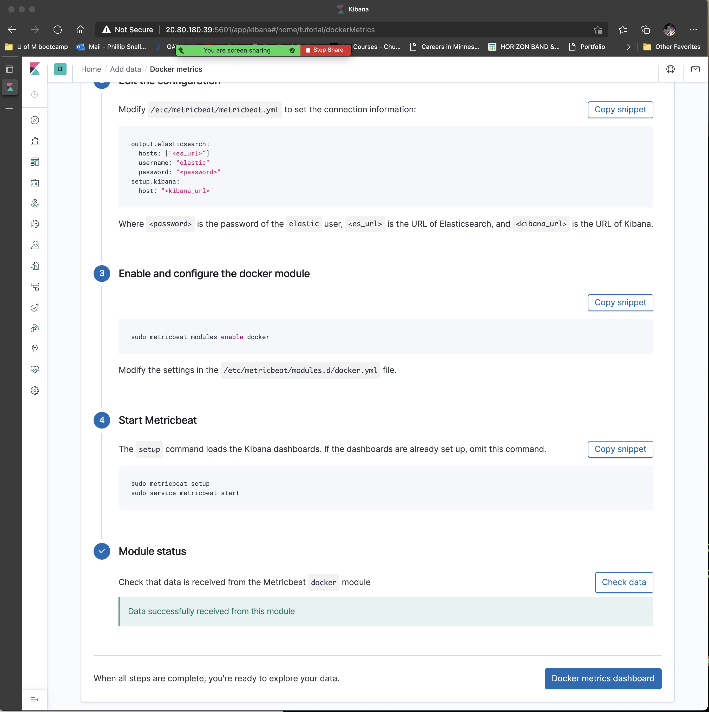

## Automated ELK Stack Deployment by Phillip Snell October 1, 2021

## Welcome to Cloud Security

## My Security Journey:

The files in this repository were used to configure the network depicted below.

 

These files have been tested and used to generate a live ELK deployment on Azure. They can be used to either recreate the entire deployment pictured above. Alternatively, select portions of the `.yml` file may be used to install only certain pieces of it, such as Filebeat.

        Files have been edited and updated.
            Click On The Links Below.

  [Filebeat-Config](filebeat-configuration.yml) 

  [Filebeat-Playbook](filebeat-playbook.yml)

  [Metricbeat-Configurat](metricbeat-configuration.yml)

  [Metricbeat-Playbook](metricbeat-playbook.yml)

  [Install-Elk-Playbook](install-elk.yml)

  [Host](hosts.yml)

  Other .sh files I made 

  [roulette_dealer_finder_by_time](roulette_dealer_finder_by_time.sh)

  [Dealers_working_durring_losses](Dealers_working_durring_losses.sh)

This document contains the following details:
- Description of the Topology

- Access Policies
- ELK Configuration
  - Beats in Use
  - Machines Being Monitored
- How to Use the Ansible Build

### Description of the Topology

The main purpose of this network is to expose a load-balanced and monitored instance of DVWA, the Damn Vulnerable Web Application.

Load balancing ensures that the application will be **`highly accessible`**, in addition to restricting any **`inbound traffic`** to the network.

      Load Balancers protect when they are closed to inbound traffic unless opened by admins. It also will shift traffic somewhere else.
      ElkStack is used to monitor mega data and proccess this information to let admins monitor the daily logs and machines running. 
      The advantage of the Jump-Box is to manage devices through the Jump-Box in seperate security zones.

Integrating an ELK server allows users to easily monitor the vulnerable VMs for changes to the **`LOGS`** and system **`TRAFFIC`**.

        Filebeat monitors and collects Log files and sends them to elkstack for proccessing or indexing. 

        

 

        Metricbeat monitors and collects data from specific service, such as Redis and MySQL and so on. The metricbeat specifies how to connect, how often to collect metrics and which metric to collect. 
        A good example of metricbeats is that it monitors and analyzes system CPU, Memory and Load.In Docker metricbeat can monitor container performance metrics. 

The configuration details of each machine may be found below.
IP address of local host is temporary and changes at times.

| Name     | Function          | IP Address  | Operating System  |
|----------|-------------------|------------ |------------------ |
|Phillip   | Local Host        | 69.8.223.334| MacOs             |
|Elk Server| Monitoring        | 10.1.0.5    | Linux Ubuntu 18.4 |
|Jump Box  | Gateway           | 10.0.0.4    | Linux Ubuntu 18.4 |
|Web-1     | DVWA Server       | 10.0.0.5    | Linux Ubuntu 18.4 |
|Web-2     | DVWA Server       | 10.0.0.7    | Linux Ubuntu 18.4 |

### Access Policies

The machines on the internal network are not exposed to the public Internet. 

Only the **Jump-Box Provisioner** machine can accept connections from the Internet. Access to this machine is only allowed from the following IP addresses:
          
          Jump-Box public IP: 20.106.143.99

Machines within the network can only be accessed by **Jump-Box Provisioner**.
          
          Jump-box private IP: 10.0.0.4 | public IP: 20.106.143.99 

A summary of the access policies in place can be found in the table below.

| Name        | Publicly Accessible | Allowed IP Addresses|
|-------------|---------------------|---------------------|
| Phillip     | Yes                 | 10.0.0.0/16 - 10.1.0.0/16 |
| Jump Box    | Yes                 | 10.0.0.0/16 - 10.1.0.0/16 |
| Elk Server  | No                  | 10.1.0.5
| Web-1       | No                  | 10.0.0.0/16 - 10.1.0.0/16 |
| Web-2       | No                  | 10.0.0.0/16 - 10.1.0.0/16 |

### Elk Configuration

Ansible was used to automate configuration of the ELK machine. No configuration was performed manually, which is advantageous because...

        Automation is the future and if you can free up admins for other work, moving forward, the future will look brighter. Automating daily tasks is best practice to eliminate errors also. By using the same playbooks updating and installing web servers to the network will be much faster and easier.

The playbook implements the following tasks:
- ...  **Install docker .io, install pip3 python3, docker python module**
 

The following screenshot displays the result of running **docker ps** after successfully configuring the ELK instance.

### Target Machines & Beats
This ELK server is configured to monitor the following machines:

        Web-1 10.0.0.5 and Web-2 10.0.0.7

We have installed the following Beats on these machines:

      Filebeats and metricbeats

 

These Beats allow us to collect the following information from each machine:

**Filebeat is a light-weight shipper that centralizes and forwards data logs.**

**Metricbeat is also a light-weight shipper that collects metric from your system and services. From CPU to Memory, Load to Network and Redis to NGINX and much more it is a light-weight way to send system and service statistics. Metricbeat collects data from your filebeat and sends it to your monitoring cluster.**

### Using the Playbook
In order to use the playbook, you will need to have an Ansible control node already configured. Assuming you have such a control node provisioned: 

### Commands I used to run the Ansible playbooks and update files.

        cd /etc/ansible/files then run theses below
        ansible-playbook install-elk.yml
        ansible-playbook filebeat-playbook.yml and ansible-playbook metricbeat-playbook.yml
        http://20.80.180.39:5601/app/kibana

        

### Below are the actual screen shots of the commands I ran.

 

### Configure ELK VM with Docker

 

 

### Install and Launch Filebeat

 

 

### Install Metricbeat

 

 

### Loaded Kibana web page

 

